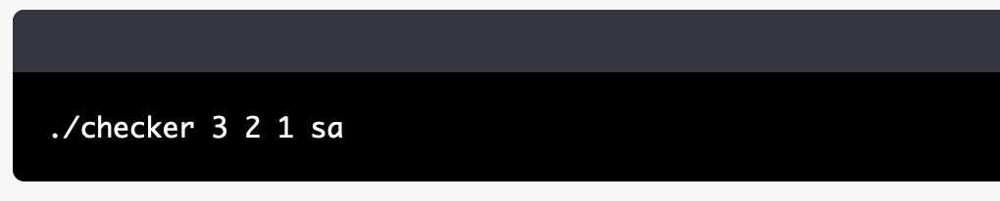

Push_swap is a project that implements a set of algorithms for sorting a list of integers using a limited set of operations. The project includes two programs: push_swap, which generates a list of instructions for sorting a given list of numbers, and checker, which can be used to verify the correctness of the generated instructions.

To build and run the project, you will need to have the GNU Compiler Collection (GCC) installed on your system. Once you have installed GCC, you can clone the project repository and use the provided Makefile to build the push_swap and checker programs.

To run push_swap, you will need to provide a list of integers as command line arguments. For example, to sort the list 3 2 1, you can run the following command:

./push_swap 3 2 1

This will generate a list of instructions for sorting the given list of numbers. The instructions will be printed to the standard output, and they can be used with the checker program to verify their correctness.

To run checker, you can use the -v option to enable visual mode, which will display the state of the list after each instruction is executed. You can also use the -c option to enable color output, which will highlight the instructions and their effects in different colors.

To use the generated instructions with checker, you can provide them as command line arguments, followed by the original list of numbers. For example, to verify the instructions generated in the previous example, you can run the following command:

./checker 3 2 1 sa

This will execute the sa instruction, which swaps the top two elements of the list, and it will print the resulting list to the standard output. If the instructions are correct and the list is fully sorted, checker will print OK to the standard output. Otherwise, it will print KO to indicate that the instructions are incorrect.

Overall, Push_swap is a well-implemented project that provides a useful set of algorithms for sorting lists of numbers using a limited set of operations. The project is well-documented and easy to build and run, making it a valuable resource for anyone interested in learning more about sorting algorithms or implementing a similar program.
